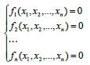
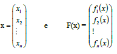
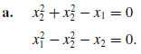
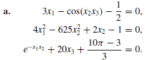
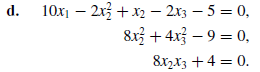
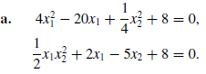
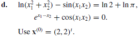
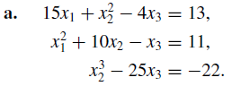
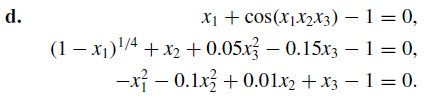

# Sistemas não lineares

## RESOLUÇÃO DE SISTEMAS NÃO LINEARES
Uma equação que contenha uma expressão do tipo x^2, y^-2, x.y, √y/z, sen(x), exp(x+z), etc, é chamada não-linear em x, y, z, ..., porque ela não pode ser escrita como:
						> ax + by + cz + ... = cte
que é uma equação linear em x, y, z, ...
Um sistema de *n* equações e *n* incógnitas x_1, x_2, ..., x_n é chamado de não-linear se uma ou mais equações é não-linear. Trazendo todos os termos diferentes de zero à esquerda de todas as equações, tem-se uma forma geral que pode ser usada para qualquer sistema não-linear.



Em notação vetorial, o sistema linear acima pode ser escrito como: **F(x) = 0**, em que



Um vetor X* = (x_1,x_2,...,x_n) que satisfaz **F(X\*) = 0** é denominado *raiz do sistema não linear*

# Metodos Utilizados

## Ponto fixo no R^n

No caso de um sistema não linear com N variaveis o procedimento se dá na seguinte forma, dado um conjunto de aproximações inicial x_0 para o vetor **x**, o método consiste em iterar sucessivamente a função dada sobre x_0, ou seja, constrói-se a sequência recursiva x_{n + 1} = f^{n + 1}(x_0) = f^{n}((f(x_0)) sendo cada x_{n} uma nova aproximação do ponto fixo **x** quando **F(x) = 0**, encerramos o loop e temos que **x** é a solução do sistema

## Método de Newton 

O método mais amplamente estudado e conhecido para resolver sistemas de equação não lineares é o Método de Newton.

O método se baseia em fazer uma escolha de uma aproximação inicial e atribuir em um vetor **x**, apos isso calcula-se **F(x)** e a matriz jacobiana **J(x)** associada a **F**. Depois resolvese o seguinte sistema linear

>	**J(x)y = -F(x)**

onde o vetor **y** é a icognita a ser determinada após isso atualizamos o valor de **x** definindo **x = x + y**, e por fim verificamos se a norma de **y** é menor que a tolerancia permitida, caso seja o programa se encerra e o valor **x** calculado é a aproximação da solução do sistema. 

A vantagem é que, sob certas condições sobre a aproximação inicial **x^(0)**, a função **F** e a matriz Jacobiana **J**, a sequência {x^(k)} produzida pelo método de Newton converge para a solução de **F(x) = 0** com taxa quadrática.

## Steepest Descents

O método Steepest Descents converge apenas linearmente para a solução, mas geralmente convergem mesmo para aproximações iniciais pobre. Como consequência, este método é usado para encontrar uma aproximação inicial com grande precisas para o metodo de Newton. O método de Steepest Descents determina um local mínimo para uma função de vvarias variável na forma g: R^n -> R. O método é valioso por ser independentemente da aplicação como do ponto de partida para resolver sistemas não-linear.

O metdo consiste nos seguintes passos

* Escolher uma aproximação inicial para o vetor **x**
* Calcular g onde g: R^n -> R
* Calcular o gradiente de g ,(z = grad g(**x^(k)**))
* obter a norma de g ,(z_0 = ||z||)
* calcular o vetor unitario ,(z = z/z_0)
* Determine a direção de **x^(0)** que diminui g, sugestão use o polinomio interpolador de Newton e apartir deste calcule o minimo
* Andar nesta direção e obtém x^(1), x = x -*a*z (onde *a* é o ponto de minimo do polinomio interpolado de Newton)
* Repetir até alcançar a precisão desejada


# Exercicios















para compilar os exercicios a seguir use:

>  gcc -L.\linalg\lib -Wl,-rpath=.\linalg\lib -llinalg -o main .\set10.1\main.c -I.\linalg\include

``` c

```

# menções

@thadeupenna

# Referencias

wwwp.fc.unesp.br\Numerico\SNLinear
